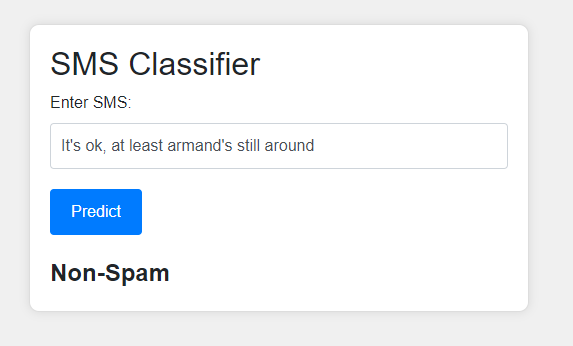
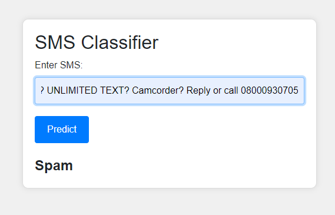

**Spam Classification Project**
================================

**Overview**
------------

This project uses machine learning to classify SMS messages as spam or not spam. The project includes data preprocessing, feature extraction, model training, and model evaluation.


**Installation**
---------------

1. Clone the repository: `git clone https://github.com/your-username/spam-classification.git`
2. Install the required libraries: `pip install -r requirements.txt`
3. Download the NLTK data: `python -m nltk.downloader stopwords wordnet punkt`

**Usage**
-----

### Training the Model

To train the model, follow these steps:

1. **Prepare the Data**: Run the command `python dataset.py` to prepare the dataset for training. This script will load the dataset, preprocess the text data, and split it into training and testing sets.
2. **Train the Model**: Run the command `python train.py` to train the model using the preprocessed data. This script will train a machine learning model using the training data and evaluate its performance using the testing data.

You can choose the classification model and apply stemming or lemmatization during the training process by using the following arguments:

* `--model`: Choose the classification model (logistic_regression or multinomial_nb)
* `--stem`: Apply stemming
* `--lemmatize`: Apply lemmatization

Example:
```bash
python train.py --model logistic_regression --stem --lemmatize
```
This will train a logistic regression model with stemming and lemmatization.

### Testing the Model

To test the model, follow these steps:

1. **Load the Trained Model**: Run the command `python test.py` to load the trained model.
2. **Enter an SMS Message to Classify**: Enter an SMS message to classify by typing `Enter an SMS: <message>`. The model will classify the message as spam or not spam based on its content.

**Deployment**
-------------

The project can be deployed using two frameworks: FastAPI and Flask.

### FastAPI Deployment

To deploy the project using FastAPI, run the following command:
```bash
python deploy_FastAPI.py
```
This will start the FastAPI server on `http://127.0.0.1:8000`. You can access the web interface by visiting this URL in your browser.

### Flask Deployment

To deploy the project using Flask, run the following command:
```bash
python deploy_Flask.py
```
This will start the Flask server on `http://127.0.0.1:8000`. You can access the web interface by visiting this URL in your browser.

**Output**

The output of the project using Flask and FastAPI is shown below:

**Non-Spam**



**Spam**



These images show the output of the project using Flask and FastAPI, respectively.

**Configuration**
--------------

The project uses a configuration file `config.json` to store settings such as the data path, model type, and save model path. You can modify this file to change the project settings.

**Model Evaluation**
-----------------

The project evaluates the model using accuracy, AUC-ROC score, precision, recall, and F1 score. You can modify the `train.py` file to add or remove evaluation metrics.
